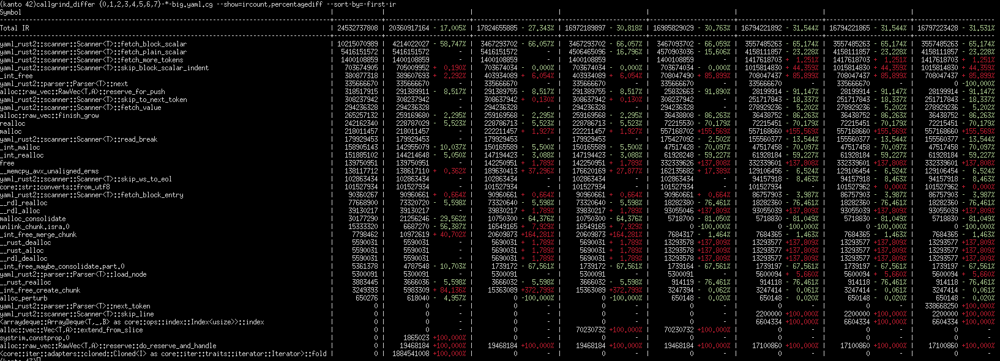

# callgrind_differ

`callgrind_differ` is a tool that compares the output of different
[`callgrind_annotate`](https://valgrind.org/docs/manual/cl-manual.html#cl-manual.callgrind_annotate-options) outputs.
This allows for precise and visual indications on the instruction count of an executable at different times during its
development.

**Disclaimer:** Instruction counting is **not** an absolute metric for performance. It is only one amongst many that can
be used to speed up programs. There are many more factors to take into account. There are however use-cases where
instruction count may relate closely to wall-time performance and my use-case was one of these.

# Screenshot


This screenshot features 8 times the same program run, at different stages of manual optimization (compiler flags were
the same). The first data column is the oldest run and the last one the most recent. The overall decrease in instruction
count from the beginning to the end was 31.531%.

The first column is the symbol name, and following columns are metrics taken on a run of the program. In this instance,
the first column of data is taken as a reference (hence why it has no +/- percentage). All other columns are compared to
it. The instruction count is repeated for all other columns.

# Features
  * Can take as input any number of `callgrind_annotate` outputs and compare them
  * Colored output (green for a decrease in instruction count, red for an increase)
  * Ability to sort by whichever column (including symbol)
  * Auto-removes symbols whose instruction count never changes (can be disabled with `--all`)
  * Any column can be taken as the reference, including the ability to compare each column to the one immediately
    preceding it
  * Can show instruction count, the difference in instruction count and percentage of change (or ratio if >1000%)
  * String replacement in symbols.

# How to use
### Example scenario: Trying to optimize
#### Creating a first callgrind file
Find your favourite benchmark code and compile with optimizations but *leave debug info enabled*. For C/C++, this should
be something along the lines of `-O2 -g`, and for Rust setting the `CARGO_PROFILE_RELEASE_DEBUG` environment variable to
`true`.

Run `valgrind` with the `callgrind` tool as you would normally. I personally use some flags which may or may not help:
```sh
valgrind --tool=callgrind --dump-instr=yes --collect-jumps=yes ./your_executable <arguments to your executable...>
```

This will generate a `callgrind.out.<pid>` file. Run `callgrind_annotate` on that file and redirect the output to a file:
```sh
callgrind_annotate --auto=no --threshold=99.99 callgrind.out.<pid> > run_1.callgrind
```
You may freely discard the `callgrind.out.<pid>`. `callgrind_differ` does not use it. The options you pass to
`callgrind_annotate` are yours to choose. You may specify `--auto=yes` (the default) but `callgrind_differ` will not use
the extra text it generates.

#### Creating a second callgrind file and diffing
Make changes into your code, re-compile and re-run both `valgrind` and `callgrind_annotate` (make sure to run it on the
*new* callgrind file) and redirect its output to another file (say `run_2.callgrind`).

You may then use `callgrind_differ` to compare whether your changes improved the instruction count or not:
```sh
callgrind_differ run_1.callgrind run_2.callgrind
# Or, if you use bash expansions
callgrind_differ run_{1,2}.callgrind
```

### Example scenario: Measuring improvements from the past
Say you have a benchmark command and you can run it through multiple commits. You may use something akin to the
following to generate `callgrind_annotate` files throughout your git history.

The following example uses Rust, but you may freely replace your compile command and execution:
```sh
set euo -pipefail

# `$x` is used as a prefix for `callgrind_annotate` output files.
# This allows for files to show in-order when listing directories
x=0

export CARGO_PROFILE_RELEASE_DEBUG=true

for commit in f7bed8e master develop rc-v1.3.0; # You may use git hashes, tags, branches, ...
                                                # Anything you can checkout to will do
do
  # === Checkout to the given commit
  git checkout ${commit}

  # === Build and run through callgrind
  cargo build --release --bin benchmarks # or `gcc -O2 -g`
  valgrind --tool=callgrind --dump-instr=yes --collect-jumps=yes ./target/release/benchmarks input_file

  # === Annotate the output file
  # The line below creates a variable named `$cg_file` with the last modified file matching `callgrind.out.*`
  cg_file=`\ls -1t callgrind.out.* | head -n1`
  callgrind_annotate --auto=no --threshold=99.99 $cg_file > ${x}-${commit}.cg

  # === Cleanup
  rm ${cg_file}; # Don't remove `${x}-${commit}.cg` ;)

  ((x++))
done
```

This will create files `0-f7bed8e.cg`, `1-master.cg`, `2-develop.cg` and `3-rc-v1.3.0.cg`.

You can compare them all (assuming `f7bed8e` is older than `master` which is older than `develop` which is older than
`rc-v1.3.0`) using:
```sh
callgrind_differ 0-f7bed8e.cg 1-master.cg 2-develop.cg 3-rc-v1.3.0.cg
# If you have no other `.cg` file in your current directory, you can do
callgrind_differ {0,1,2,3}-*.cg
# which is pretty handy.
```

# Options
```
$> callgrind_differ -h
A tool to help keep track of performance changes over time

Usage: callgrind_differ [OPTIONS] [INPUTS]...

Arguments:
  [INPUTS]...  `callgrind_annotate` files or CSV file. Positional arguments

Options:
  -a, --all
          Show all lines, even those without a change
  -c, --color <COLOR>
          Whether the output should be colored or not [default: always]
      --sort-by <SORT_BY>
          By which field to sort by [default: symbol]
      --csv-export <CSV_EXPORT>
          Path to an output file in which to write the IR as CSV [default: ]
      --csv-names [<CSV_NAMES>...]
          A comma-separated list of column names for the CSV export
      --string-replace [<STRING_REPLACE>...]
          A replacement to perform in the symbol names
      --export-graph <EXPORT_GRAPH>
          Path to an output file in which to write a graph of the IR values. Currently unsupported [default: ]
      --relative-to <RELATIVE_TO>
          The column which is the reference for IR. Other columns have diffs relative to it [default: first]
      --show [<SHOW>...]
          A comma-separated list of what to show for each column of data
  -h, --help
          Print help (see more with '--help')
```

More details can be obtained with `callgrind_differ --help`.

# To-do list
This list is of course not final. You may or may not expect these to be implemented (it will all depend on my needs).
You are free to implement these and submit a pull request, or file an issue if you think this could benefit from another
feature.

  * Detect whether the output is a terminal to conditionally enable colors
  * Input and output from/to CSV files
  * Name runs/columns
